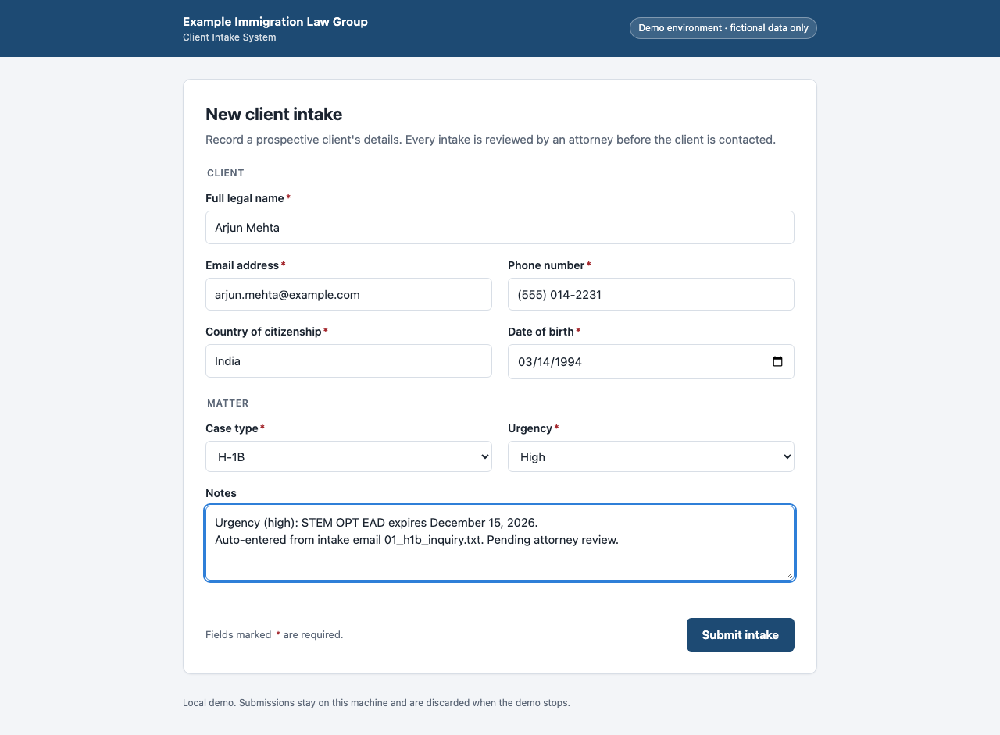
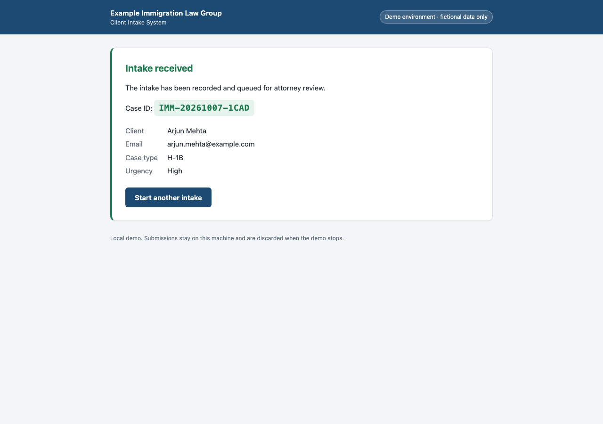

# Immigration Intake Automation

Turns emails from prospective immigration clients into completed intake records, automatically.

It reads an inquiry (a text file or PDF), uses AI to pull out the client's details, fills in an intake form in a real browser, checks that the submission went through, and writes a summary report. Anything incomplete is held back for a human instead of being guessed.

> **This is a portfolio demo.** All names, emails and phone numbers are fictional. The "intake system" is a small form that runs on your own computer. The project never contacts any government, court or law-firm website.

---

## The problem

An immigration law firm gets a steady stream of inquiry emails. For each one, someone has to:

1. Read the email and work out what the client needs (work visa, marriage green card, citizenship...).
2. Retype the client's details into the firm's intake system.
3. Judge how urgent the matter is. A visa expiring next month can't wait in a queue.
4. Write back if anything is missing.
5. Prepare a list of documents the client should gather.

This is repetitive, easy to get wrong, and time-sensitive. This project automates the clerical work and keeps people in charge of every decision that reaches a client.

## What it does

For every file in `sample_inputs/`, the program runs these steps:

| # | Step | What happens |
|---|---|---|
| 1 | **Read** | Loads the email from a `.txt`, `.pdf`, `.eml` or `.md` file. |
| 2 | **Extract** | AI pulls out the five required details (name, email, phone, country of citizenship, date of birth), the case type (H-1B, Family Green Card, Naturalization or Other) and urgency with a reason, plus optional background when the client mentions it: country of birth, current city, marital status, preferred contact method, immigration status and its expiry date, occupation, employer, education, case subtype, whether they want a consultation, and a one-line matter summary. The result is checked against strict rules. If the answer is invalid it retries once, then flags the record for a person. |
| 3 | **Decide** | If any required detail is missing, the record is **not submitted**. The AI drafts a polite follow-up email asking for exactly what's missing, saved for staff to review. |
| 4 | **Fill the form** | For complete records, a browser (Playwright) opens the intake form, types every field and clicks Submit. You can watch it happen. |
| 5 | **Verify** | The program checks that a confirmation and case ID appeared **and** that the intake system stored the same details. It marks the record PASS or FAIL and saves a screenshot. |
| 6 | **Checklist** | For each accepted case, the AI drafts a list of documents the client typically needs, marked as a draft for attorney review. |
| 7 | **Report** | Writes `outputs/run_report.pdf` with counts, PASS/FAIL, timings, every client's details, confirmation screenshots and next steps for staff. A Markdown copy (`run_report.md`) is saved next to it. |

One bad file never stops the run. The problem is recorded in the report and the next file is processed.

## Quick start

You need Python 3.10 or newer.

```bash
git clone https://github.com/AshwinSanthanakrishnan/immigration-intake-automation.git
cd immigration-intake-automation

python3 -m venv .venv
source .venv/bin/activate
pip install -r requirements.txt
playwright install chromium

cp .env.example .env
```

Open `.env` and replace `your-gemini-api-key` with your own [Google Gemini API key](https://aistudio.google.com/apikey). The `.env` file is ignored by git, so your key is never uploaded.

Then run it:

```bash
python main.py
```

A browser window opens and fills in the form for each client. Results appear in the `outputs/` folder.

### No API key?

```bash
python main.py --offline
```

This replaces the AI with a few simple keyword rules so you can see the whole flow without a key. Everything it produces is labeled as offline output.

### Other options

| Command | What it does |
|---|---|
| `python main.py --headless` | Runs the browser invisibly. |
| `python main.py --slow-mo 800` | Slows browser actions, useful for screen recordings. |
| `python main.py --inputs my_folder` | Reads emails from a different folder. |
| `python main.py --model <name>` | Uses a different Gemini model. |
| `./run.sh` | Sets up the environment if needed, then runs the project. |
| `python -m pytest` | Runs the tests (no internet or API key needed). |

The program exits with code `0` if every submitted record verified, and `1` if there was a verification failure or an error.

> **Free-tier note:** Gemini's free plan limits how many requests you can make per minute. With all 10 sample files the run slows down while it waits, and a record may be flagged for human review if the limit isn't lifted in time. A paid key, or running on fewer files, avoids this.

## Sample data

`sample_inputs/` contains 10 fictional inquiries, covering H-1B, family green card, naturalization and humanitarian matters. Some are PDFs. One is deliberately messy and missing the phone number and date of birth, to show the follow-up path.

## What you get

After a run, the `outputs/` folder contains:

| Path | Contents |
|---|---|
| `run_report.pdf` | The summary of the whole run. Start here. |
| `run_report.md` | The same report as Markdown. |
| `screenshots/` | A screenshot of each confirmation page. |
| `followups/` | Draft replies to clients with missing information. |
| `checklists/` | Draft document checklists, one per accepted case. |
| `needs_review/` | Records the AI couldn't process reliably, for a person to handle. |
| `logs/` | A detailed log of each run. |

Example from a run on the sample files:

| Source | Client | Case type | Urgency | Outcome | Verification |
|---|---|---|---|---|---|
| 01_h1b_inquiry.txt | Arjun Mehta | H-1B | High | Submitted | PASS |
| 02_family_green_card_inquiry.txt | Maria Elena Santos | Family Green Card | Medium | Submitted | PASS |
| 03_naturalization_inquiry_messy.txt | Kwame Boateng | Naturalization | Low | Follow-up drafted | n/a |
| 04_h1b_transfer_alex_chen.pdf | Alex Chen | H-1B | High | Submitted | PASS |

| The form, filled in by the browser | The verified confirmation |
|---|---|
|  |  |

## How the code is organized

| File | Job |
|---|---|
| `main.py` | The single command that runs everything. |
| `src/input_reader.py` | Finds and reads the email files, including PDFs. |
| `src/ai_client.py` | Talks to the AI and holds the instructions it is given. |
| `src/extraction.py` | Checks the AI's answer and retries once if it's invalid. |
| `src/models.py` | Defines what a valid intake record looks like. |
| `src/form_server.py` | The local stand-in for the firm's intake system. |
| `src/form_filler.py` | The browser automation that fills in and submits the form. |
| `src/verification.py` | Confirms each submission landed and takes the screenshot. |
| `src/drafts.py` | Saves follow-up emails and checklists with review banners. |
| `src/reporting.py` | Builds the run report (Markdown). |
| `src/report_pdf.py` | Renders the run report as a PDF. |
| `src/pipeline.py` | Runs the steps above for each file. |
| `src/offline_ai.py` | The keyword-rule stand-in used by `--offline`. |
| `intake_form/index.html` | The demo intake form. |
| `tests/` | Automated tests. |

## Privacy and safety

- **Fictional data only.** Every person, email address and phone number in the project is made up, and so is the firm named on the form.
- **No real websites.** The browser only visits the practice form served from your own computer. The only outside connection is to the AI provider.
- **Humans stay in control.** Nothing is ever sent to a client. Follow-ups are saved as drafts marked `DRAFT - NOT SENT`, and checklists are marked `DRAFT FOR ATTORNEY REVIEW. NOT LEGAL ADVICE.` The program adds these labels itself, so the AI can't leave them out.
- **Incomplete means not submitted.** A record with missing details is never entered into the system. The program, not the AI, decides what counts as missing.
- **Share as little as possible.** The checklist step sends the AI only the case type and country, never the client's name, contact details or date of birth.
- **Secrets stay local.** Your API key lives in `.env`, which git ignores, and is never logged. The `outputs/` folder is also ignored, because in real use it would hold client information.
- **In production,** the form filler would point at the firm's real intake system instead of the local practice form. It would also need access controls, audit logging, a retention policy for stored data, and a review of how the AI provider handles client information.
