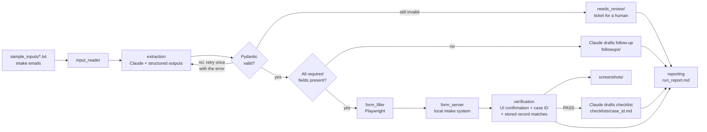

# immigration-intake-automation

Turns free-form emails from prospective clients into validated intake records. It uses Claude for understanding, Pydantic for trust and Playwright to enter the data, then checks that every submission actually landed.

> **Portfolio demo.** All data is fictional and the "intake system" is a local page. The project never contacts a government, court or real law-firm website.

## The problem it solves

An immigration practice receives a steady stream of inquiry emails. Each one has to be read, the client's details copied into the intake system, the matter classified (H-1B, family green card, naturalization...) and triaged for urgency. If something is missing, someone has to write back. If the matter goes ahead, an attorney needs a starting document list. That work is repetitive and error-prone, and it's time-sensitive: a missed status-expiration date in an email is a real risk to the client.

This project automates the clerical part and keeps humans on every decision that reaches a client:

| Step | What happens | Human checkpoint |
|---|---|---|
| 1. Input | Reads `.txt` intake emails from `sample_inputs/` | |
| 2. AI extraction | Claude extracts name, email, phone, citizenship, date of birth, case type, urgency (with reason) and missing fields as JSON. Pydantic validates it; an invalid answer is retried once, then flagged | Invalid output goes to `needs_review/` |
| 3. Decision | Missing required fields mean the record is **not** submitted. Claude drafts a polite follow-up asking for exactly what's missing | Staff approve the draft before sending |
| 4. Browser action | Playwright fills and submits the intake form for complete records (headed with slow-mo by default) | |
| 5. Verify | Asserts the confirmation and case ID in the UI, and that the intake system stored the same values. Marks PASS or FAIL and screenshots it | FAILs are surfaced in the report |
| 6. Case checklist | Claude drafts a document checklist per submitted case, labeled as a draft for attorney review | Attorney reviews before use |
| 7. Report | `outputs/run_report.md`: counts, PASS/FAIL, timings and next steps for staff | |

## Architecture



| Module | Responsibility |
|---|---|
| `src/input_reader.py` | Lists and reads intake emails; rejects empty, undecodable or oversized files |
| `src/ai_client.py` | The `IntakeAI` interface plus its Claude implementation and prompts |
| `src/extraction.py` | Validates model output with Pydantic; retries once, then flags for review |
| `src/models.py` | The extraction schema (`IntakeExtraction`) and per-record results |
| `src/drafts.py` | Saves follow-ups, checklists and review tickets with review banners added in code |
| `src/form_server.py` | Local stand-in for the firm's intake system (serves the form, issues case IDs) |
| `src/form_filler.py` | Playwright browser session; fills and submits the form |
| `src/verification.py` | PASS/FAIL assertions and screenshots |
| `src/reporting.py` | Run summary and Markdown report |
| `src/pipeline.py` | Orchestration, with an error boundary around each record |
| `src/offline_ai.py` | Rule-based stand-in for `--offline` runs (no AI) |

## Setup

Requires Python 3.10+.

```bash
python3 -m venv .venv
source .venv/bin/activate
pip install -r requirements.txt
playwright install chromium
cp .env.example .env    # then put your key in GEMINI_API_KEY
```

`.env` settings:

| Variable | Default | Purpose |
|---|---|---|
| `GEMINI_API_KEY` | (required) | Your Google Gemini API key. `.env` is gitignored |
| `GEMINI_MODEL` | `gemini-3.5-flash` | Model used for AI extraction and drafting |

## How to run

```bash
python main.py                 # full run: Gemini + visible browser with slow-mo
python main.py --headless      # same, without a browser window
python main.py --slow-mo 800   # slower browser actions for a screen recording
python main.py --offline       # no API key: rule-based stand-in instead of Gemini
python main.py --inputs path/to/emails
```

`--offline` swaps Claude for a few keyword and regex rules, so the browser, verification and reporting steps can be demoed or smoke-tested without a key. Its output goes through the same validation and is labeled "Offline rule-based stand-in (no AI calls)" everywhere it appears.

The exit code is `0` when every submitted record verified, and `1` when there was a verification failure or an error, so it can gate a CI job. Follow-ups and human-review flags are normal outcomes and don't fail the run.

Run the tests:

```bash
python -m pytest
```

The tests cover extraction validation and the retry-then-flag policy, report counts and rendering, the intake server, and the sample emails. None of them call the API.

## Sample output

Console (an `--offline --headless` run on the three sample emails):

```text
22:59:37  INFO    Found 3 intake email(s) in sample_inputs
22:59:37  INFO    Local intake system running at http://127.0.0.1:49569/
22:59:37  INFO    --- [1/3] 01_h1b_inquiry.txt ---
22:59:37  INFO    Extracted: Arjun Mehta | H-1B | urgency high | missing: none
22:59:37  INFO    Launched Chromium (headless)
22:59:37  INFO    Intake system recorded case IMM-20261007-1CAD
22:59:37  INFO    Verification PASS: Confirmation shown; case IMM-20261007-1CAD recorded with matching details
22:59:37  INFO    Saved document checklist draft for case IMM-20261007-1CAD
22:59:37  INFO    --- [2/3] 02_family_green_card_inquiry.txt ---
22:59:37  INFO    Extracted: Maria Santos | Family Green Card | urgency medium | missing: none
22:59:37  INFO    Verification PASS: Confirmation shown; case IMM-20261007-E709 recorded with matching details
22:59:37  INFO    --- [3/3] 03_naturalization_inquiry_messy.txt ---
22:59:37  INFO    Extracted: Kwame Boateng | Naturalization | urgency low | missing: phone, date_of_birth
22:59:37  INFO    Not submitted: drafted a follow-up asking for phone number, date of birth
22:59:38  INFO    Done in 1.3 s: 3 processed, 2 submitted (2 PASS, 0 FAIL), 1 follow-up, 0 human review, 0 error
```

Excerpt from `outputs/run_report.md`:

| # | Source email | Client | Case type | Urgency | Outcome | Case ID | Verification |
|---:|---|---|---|---|---|---|---|
| 1 | 01_h1b_inquiry.txt | Arjun Mehta | H-1B | High | Submitted | IMM-20261007-1CAD | PASS |
| 2 | 02_family_green_card_inquiry.txt | Maria Santos | Family Green Card | Medium | Submitted | IMM-20261007-E709 | PASS |
| 3 | 03_naturalization_inquiry_messy.txt | Kwame Boateng | Naturalization | Low | Follow-up drafted | - | n/a |

| The form, filled by Playwright | The verified confirmation |
|---|---|
|  |  |

Generated files:

```text
outputs/
├── run_report.md
├── followups/03_naturalization_inquiry_messy_followup.txt
├── screenshots/IMM-20261007-1CAD.png, IMM-20261007-E709.png
├── checklists/IMM-20261007-1CAD.md, IMM-20261007-E709.md
├── needs_review/          (empty unless extraction failed twice)
└── logs/run_20261007_225937.log
```

In a live run, Claude writes the urgency reasons, follow-up and checklists, so the wording differs from the offline rules above.

## Design notes

- **Structured outputs plus Pydantic.** Claude answers through a JSON schema generated from the same Pydantic model that validates it, so the shape is constrained at generation time. Pydantic then enforces business rules a schema can't express: a plausible date of birth, an email format, phone digit counts, and allowed values for case type, urgency and missing fields.
- **Code has the final say on completeness.** Any empty required field is added to `missing_fields` even if the model reported the record as complete, so an incomplete record can never be submitted on the model's word.
- **Retry with feedback, then stop.** The one retry includes the exact validation error. A second failure produces a review ticket containing the raw outputs, rather than a guess.
- **Verify the system, not just the screen.** PASS requires the confirmation panel, a well-formed case ID *and* a stored record under that ID whose values match what was submitted.
- **Isolated failures.** Each record runs inside its own error boundary. An unreadable file, an API error or a browser timeout is recorded in the report, and the run continues.
- **Refusal handling.** Requests opt into server-side fallback (`fallbacks: "default"`), and a refusal or truncated answer counts as an invalid attempt instead of crashing.

## Privacy and safety

- **Fictional data only.** Every name, email (`example.com`) and phone number (`555-01xx`) in `sample_inputs/` is made up. The firm on the form, "Example Immigration Law Group", doesn't exist.
- **No real websites.** The browser only visits a form served from `127.0.0.1` by `src/form_server.py`, which binds to localhost and keeps submissions in memory. The only external call is to the Anthropic API.
- **Human review before anything reaches a client.** Nothing is ever sent. Follow-up emails are saved as drafts headed `DRAFT - NOT SENT` for staff approval. Checklists are headed `DRAFT FOR ATTORNEY REVIEW. NOT LEGAL ADVICE.` These banners are added by code, not left to the model. Records that fail validation go to a person, not into the system.
- **Data minimization.** The checklist prompt sends only the case type and country of citizenship, never the client's name, contact details or date of birth. The follow-up prompt never asks for passport, A-number or Social Security numbers.
- **Prompt-injection awareness.** Prompts treat email content as untrusted data and tell the model never to follow instructions inside it. Structured outputs and validation limit what a malicious email could change.
- **Secrets.** The API key is read from `.env` (gitignored) or the environment and is never logged. `outputs/` is gitignored too, because in real use it would hold client data.
- **In production** the form filler would point at the firm's real intake system (or its API) instead of the local stand-in. That deployment would also need access controls, audit logging, a data-retention policy for `outputs/` and logs, and a vendor review covering how client data is handled by the AI provider.

## Project structure

```text
immigration-intake-automation/
├── main.py                 # single entry point: python main.py
├── requirements.txt
├── .env.example            # copy to .env
├── pytest.ini
├── sample_inputs/          # 3 fictional intake emails (one messy and incomplete)
├── intake_form/index.html  # the local "Client Intake" page
├── src/                    # pipeline modules (see Architecture)
├── tests/                  # pytest suite (no network)
├── docs/                   # README screenshots
└── outputs/                # generated per run (gitignored)
```
